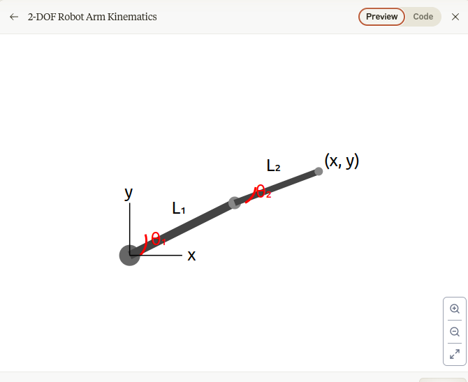
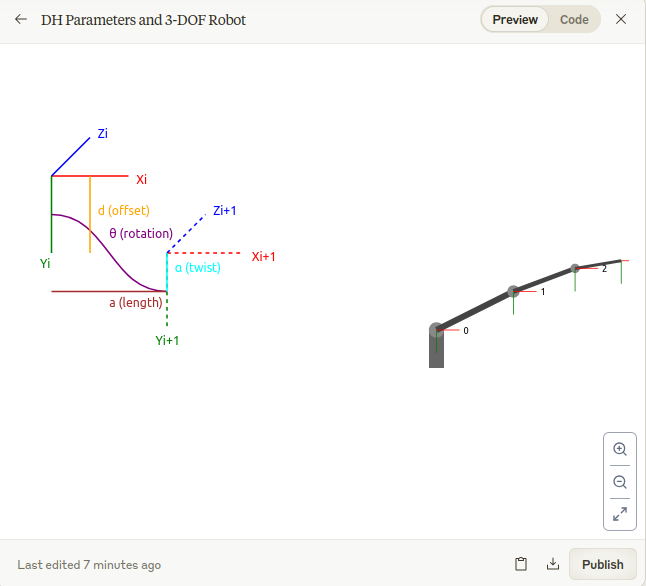

# Basic Kinematics and coordinate systems

## Right-hand coordiante system

When pointing your right thumb along the positive z-axis, your fingers naturally curl in the direction from the positive x-axis toward the positive y-axis.

This convention is fundamental in:

Classical mechanics  
Computer graphics  
Robotics  
Vector cross products  
Many other fields of physics and engineering

## Robotic Kinematics

Robot kinematics is a fundamental concept in robotics that deals with the geometric motion of robots without considering the forces that cause the motion. It focuses on the relationship between the positions, velocities, and accelerations of the robot's joints and its end-effector.

### Forward kinematics (position monitor, path plan, collision detection, visualization)

Use following 2-DOF planar example


Forward kinematics is used to determine where the robot will end up given certain joint movements.  

Input: Joint angles (θ₁, θ₂)  
Output: End-effector position (x, y)  


```
x = L₁cos(θ₁) + L₂cos(θ₁ + θ₂)
y = L₁sin(θ₁) + L₂sin(θ₁ + θ₂)
```

### Inverse Kinematics (pick/place operationsfollowing path, reaching target positions, task space control)

Inverse kinematics is used to determine how to move the joints to reach a specific position.  

Input: Desired end-effector position (x, y)  
Output: Required joint angles (θ₁, θ₂)  

```
cos(θ₂) = (x² + y² - L₁² - L₂²)/(2L₁L₂)
θ₂ = ±arccos(cos(θ₂))
θ₁ = atan2(y,x) - atan2(L₂sin(θ₂), L₁ + L₂cos(θ₂))
```

### Key Differences

- Computation Complexity:  
    Forward kinematics: Straightforward, single solution  
    Inverse kinematics: More complex, may have multiple solutions  
  
- Solution Properties:  
    Forward: Always has one unique solution  
    Inverse: May have:  
        Multiple solutions (different joint configurations for same end position)  
        No solution (point outside reachable workspace)  
        Infinite solutions (in redundant robots)  
  
- Usage Context:  
    Forward: Used for simulation, monitoring, and verification  
    Inverse: Used for task planning and control  

## Denavit-Hartenberg (DH) parameters  

Denavit-Hartenberg (DH) parameters are a standardized method in robotics to describe the geometric relationship between consecutive links of a robot manipulator by assigning coordinate frames to each link, using four key parameters: θ (joint angle), d (link offset), α (link twist), and a (link length), which allows for easy calculation of the robot's forward kinematics and inverse kinematics through transformation matrices.  

### DH Parameters Definition

θ (theta): Joint angle about Z axis
d: Offset along Z axis
a: Length along X axis
α (alpha): Twist angle about X axis

### Steps to Assign DH Parameters

- Identify and number joints from 0 to n  
- Draw Z axes along joint rotation axes  
- Establish origin of each frame  
- Draw X axes perpendicular to both adjacent Z axes  
- Draw Y axes to complete right-handed coordinate systems  

### 3-DOF Robot Example:



Here's the DH parameter table:  

Joint i | θᵢ  | dᵢ    | aᵢ    | αᵢ
--------|------|--------|--------|--------
1       | θ₁  | L₁    | 0     | 90°
2       | θ₂  | 0     | L₂    | 0°
3       | θ₃  | 0     | L₃    | 0°

Transformation Matrix:  
For each joint, the transformation matrix is:  

T = [
    cos(θ)  -sin(θ)cos(α)   sin(θ)sin(α)   acos(θ)
    sin(θ)   cos(θ)cos(α)  -cos(θ)sin(α)   asin(θ)
    0        sin(α)         cos(α)          d
    0        0              0               1
]

Practical Application:  
To find end-effector position:  

Calculate individual transformations T₁, T₂, T₃  
Multiply matrices: T_total = T₁ * T₂ * T₃  
Extract position from final matrix  

### Key Benefits

- Standardized approach for describing robot geometry
- Simplified forward kinematics calculations
- Easy to implement in software
- Consistent across different robot configurations

### Example of end-effector position for our 3-DOF robot using DH parameters 

Joint 1 (Base rotation):  

T₁ = [
    cos(θ₁)   -sin(θ₁)   0    0
    sin(θ₁)    cos(θ₁)   0    0
    0          0         1    L₁
    0          0         0    1
]

Joint 2 (First link):  

T₂ = [
    cos(θ₂)   -sin(θ₂)   0    L₂cos(θ₂)
    sin(θ₂)    cos(θ₂)   0    L₂sin(θ₂)
    0          0         1    0
    0          0         0    1
]

Joint 3 (Second link):  

T₃ = [
    cos(θ₃)   -sin(θ₃)   0    L₃cos(θ₃)
    sin(θ₃)    cos(θ₃)   0    L₃sin(θ₃)
    0          0         1    0
    0          0         0    1
]

Final Transformation Matrix  
Multiply matrices in sequence:  

```
T_total = T₁ * T₂ * T₃  
```

The resulting matrix will be of the form:  

T_total = [
    r₁₁   r₁₂   r₁₃   x
    r₂₁   r₂₂   r₂₃   y
    r₃₁   r₃₂   r₃₃   z
    0     0     0     1
]

The position components (x, y, z) are:

```
x = L₂cos(θ₁)cos(θ₂) + L₃cos(θ₁)cos(θ₂ + θ₃)
y = L₂sin(θ₁)cos(θ₂) + L₃sin(θ₁)cos(θ₂ + θ₃)
z = L₁ + L₂sin(θ₂) + L₃sin(θ₂ + θ₃)
```


